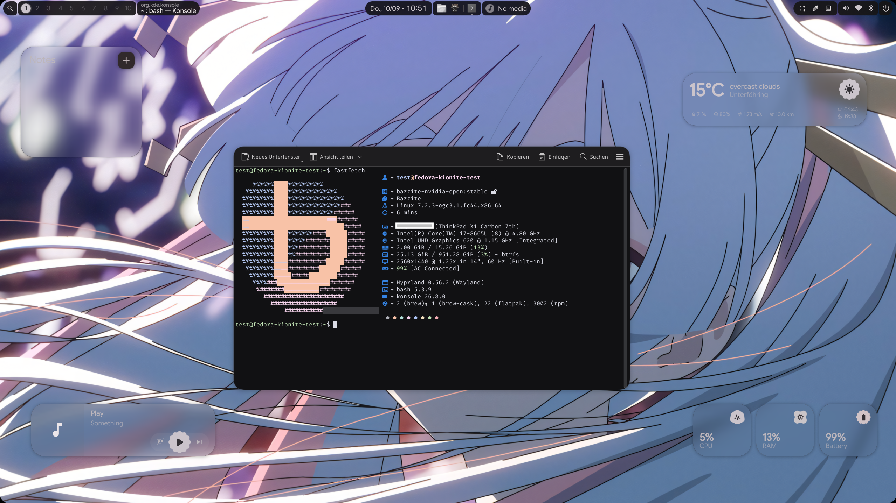

# bazz-hypr

A custom [BlueBuild](https://blue-build.org) image on top of
**Bazzite (Nvidia, open kernel modules)** that ships Hyprland with
[illogical-impulse](https://github.com/end-4/dots-hyprland) (Quickshell) as the
default desktop, plus [end4-pC](https://github.com/pctrade/end4-pC) as a second,
pre-installed shell.



KDE Plasma stays installed and selectable at the login screen. That is
deliberate, not leftovers — see [Why KDE Plasma stays](#why-kde-plasma-stays).

```
ghcr.io/timmi2k/bazz-hypr:latest
```

---

## The stack

| Layer | What runs | Where it comes from |
|---|---|---|
| Base image | Bazzite Nvidia (open kernel modules) | `ghcr.io/ublue-os/bazzite-nvidia-open:stable` |
| Compositor | Hyprland 0.56.2, Lua config | COPR `sdegler/hyprland` |
| Shell / widgets | Quickshell 0.3.1 | COPR `errornointernet/quickshell` |
| Desktop config | illogical-impulse (`ii`) | `end-4/dots-hyprland`, pinned commit |
| Desktop config (default) | end4-pC | `pctrade/end4-pC`, pinned commit |
| Fallback session | KDE Plasma | Bazzite base |
| Portals | `xdg-desktop-portal` + `-gtk`, `-kde`, `-hyprland` | Fedora / COPR |
| Keyring | gnome-keyring, unlocked by PAM at login | Fedora |
| Session entry | `Hyprland (illogical-impulse)` | `bazz-hypr.desktop` |

Two shells are installed side by side. end4-pC is a pure Quickshell config
directory and requires illogical-impulse — it sits next to it, it does not
replace it. Switch in `~/.config/hypr/custom/variables.lua`:

```lua
hl.env("qsConfig", "end4-pC")   -- default in this image
-- hl.env("qsConfig", "ii")     -- end-4's original
```

Then `Ctrl+Super+R` to restart the shell.

---

## Install

The image is signed with cosign. Rebase from an existing Bazzite install:

```bash
# 1. unsigned, to get the signing policy onto the machine
rpm-ostree rebase ostree-unverified-registry:ghcr.io/timmi2k/bazz-hypr:latest
systemctl reboot

# 2. re-pin to the signed reference
rpm-ostree rebase ostree-image-signed:docker://ghcr.io/timmi2k/bazz-hypr:latest
systemctl reboot
```

The two-step dance is only needed the first time. Afterwards
`rpm-ostree upgrade` is enough.

Rollback if something is wrong:

```bash
rpm-ostree rollback && systemctl reboot
```

### First login

* Pick **"Hyprland (illogical-impulse)"** at the bottom left of the login
  screen. SDDM remembers the choice per user; there is no clean way to preset
  it from the image.
* If a **UWSM** entry shows up as well: do not take it. The upstream
  illogical-impulse installer explicitly warns against it, and this image relies
  on being started directly (see
  [graphical-session.target](#graphical-sessiontarget-is-activated-by-nobody)).
* The first login takes longer — a ~330 MB Python venv is copied into your home.
  Once.

---

## Keybinds

`SUPER` is the Windows key. Two to remember before all others:

| Bind | What it does |
|---|---|
| `SUPER+/` | **Cheatsheet** — the full list, on screen, always current |
| `SUPER+CTRL+ALT+/` | Open `~/.config/hypr/custom/keybinds.lua` to add your own |

The tables below are generated from `hyprctl binds` on a running session, so
they match what is actually bound rather than what was intended.

### Windows

| Bind | Action |
|---|---|
| `SUPER+←/↑/→/↓` | Focus window in that direction |
| `SUPER+SHIFT+←/↑/→/↓` | Move window in that direction |
| `SUPER+Q` | Close |
| `SUPER+ALT+SHIFT+Q` | Force-kill a window |
| `SUPER+F` | Fullscreen |
| `SUPER+D` | Maximize |
| `SUPER+ALT+F` | Fullscreen spoof — app thinks it is fullscreen, the WM does not |
| `SUPER+ALT+Space` | Float / tile |
| `SUPER+P` | Pin (keep on top across workspaces) |
| `SUPER+LMB` drag | Move |
| `SUPER+RMB` drag | Resize |
| `SUPER+ALT+1…0` | Send to workspace 1–10 |
| `SUPER+SHIFT+PageUp/PageDown` | Send to workspace left/right |
| `SUPER+ALT+S` | Send to scratchpad |

### Workspaces

| Bind | Action |
|---|---|
| `SUPER+1…0` | Focus workspace 1–10 |
| `SUPER+CTRL+←/→` | Focus workspace left/right |
| `SUPER+S` | Toggle scratchpad |
| `SUPER+Tab` | Overview |

Ten workspaces, shared by both screens, with one pin: **workspace 1 is the
default of the largest monitor, workspace 2 the default of the next one.** That
is what decides where the session comes up. Everything from 3 upwards stays
free and is created on whichever monitor has focus, and all ten sit in one
group (`workspaceGroupSize = 10`), so `SUPER+<number>` means the same workspace
from either screen.

Why that needs a rule at all: without one Hyprland hands workspaces out in
connector order, so workspace 1 lands on whichever output the GPU enumerates
first — which is how workspace 1 ended up on the small screen and workspace 2
on the big one. And **Hyprland has no "primary monitor" setting**; workspace
rules are the mechanism for it, there is nothing else to set.

The pins are generated per machine into `~/.config/hypr/custom/rules.lua` from
the outputs that are actually connected, so no connector name is hardcoded in
the image. After a monitor change, delete the
`-- >>> bazz-hypr: workspace-monitors` block together with its marker and log
in again — the seed script rebuilds it. Rules apply when a workspace is
*created*, so workspaces that already exist stay on their monitor until the
next session.

### Monitors

| Bind | Action |
|---|---|
| `SUPER+ALT+←/→` | Move **window** to the monitor left/right |
| `SUPER+SHIFT+ALT+←/→` | Move the **whole workspace** to the monitor left/right |

For a fullscreen game, use the workspace variant. Moving a whole workspace keeps
the fullscreen state intact, whereas a window moved on its own snaps back as
soon as the game re-grabs fullscreen. See
[Games always on one monitor](#games-always-on-one-monitor).

Both are direction based (`l`/`r`), so they work regardless of what your outputs
are called. "Left" and "right" follow the physical layout in
`~/.config/hypr/monitors.lua`, not the connector names.

### Apps

| Bind | Action |
|---|---|
| `SUPER+Space` | **Application grid** — everything that is installed |
| `SUPER+Return` | Terminal |
| `SUPER+W` | Browser |
| `SUPER+E` | File manager |
| `SUPER+C` | Code editor |
| `SUPER+X` | Text editor |
| `SUPER+I` | Settings |
| `SUPER+CTRL+V` | Volume mixer |
| `CTRL+SHIFT+Esc` | Task manager |
| `SUPER+CTRL+ALT+SHIFT+W` | Office software |

Tapping `SUPER` opens the shell's **search**, which only finds what you can
already name — there is no app list in it. `SUPER+Space` opens `nwg-drawer`
instead: an icon grid of every desktop entry on the machine, Flatpaks included,
with categories and a search of its own. Pressing it again closes the drawer.

The bind lives in `~/.config/hypr/custom/keybinds.lua` and falls back to
`fuzzel` where `nwg-drawer` is missing — `fuzzel` lists every application as
well, just as a plain list instead of a grid. Both read the same `.desktop`
files as KDE's menu did, so nothing has to be registered anywhere.

### Shell and UI

| Bind | Action |
|---|---|
| `SUPER` (tap) | Search |
| `SUPER+A` | Left sidebar |
| `SUPER+N` | Right sidebar |
| `SUPER+M` | Media controls |
| `SUPER+J` | Toggle the bar |
| `SUPER+G` | Widget overlay |
| `SUPER+K` | On-screen keyboard |
| `SUPER+CTRL+P` | Cycle panel family |
| `SUPER+CTRL+R` | Restart widgets |
| `SUPER+CTRL+SHIFT+D` | Light / dark mode |
| `SUPER+CTRL+T` | Change wallpaper |
| `SUPER+CTRL+ALT+T` | Random wallpaper |
| `CTRL+ALT+Del` | Session menu |

### Screenshots and capture

| Bind | Action |
|---|---|
| `Print` | Screenshot to clipboard |
| `CTRL+Print` | Screenshot to clipboard **and** file |
| `SUPER+SHIFT+S` | Screen snip |
| `SUPER+SHIFT+R` | Record a region, no sound |
| `SUPER+ALT+SHIFT+R` | Record the screen, with sound |
| `SUPER+SHIFT+C` | Pick a colour, `#RRGGBB` to clipboard |
| `SUPER+SHIFT+X` | OCR to clipboard |
| `SUPER+SHIFT+T` | Translate what is on screen |
| `SUPER+SHIFT+A` | Google Lens |
| `SUPER+V` | Clipboard history |
| `SUPER+.` | Emoji picker |

### Media, screen, session

| Bind | Action |
|---|---|
| `SUPER+SHIFT+P` | Play / pause |
| `SUPER+SHIFT+N` / `SUPER+SHIFT+B` | Next / previous track |
| `SUPER+SHIFT+M` | Mute |
| `SUPER+ALT+M` | Mute microphone |
| `SUPER+=` / `SUPER+-` | Zoom in / out |
| `SUPER+L` | Lock |
| `SUPER+SHIFT+L` | Sleep |
| `SUPER+CTRL+ALT+SHIFT+Del` | Shut down |

`Alt+F4` is deliberately not a close bind — it prints a reminder that `SUPER+Q`
closes windows, and stays free for Windows VMs.

---

## Games always on one monitor

Window rules send games to the **largest connected** monitor, so a game does not
open on a secondary screen. Two layers:

1. Hyprland's content type `game` — generic, but only when the client reports it
   (many Proton titles do).
2. A class regex as a fallback for everything that does not: `cs2`,
   `steam_app_<id>`, `gamescope`, `*.exe`, `steam_proton`.

Only the monitor is set, not the workspace, so a game lands on whatever
workspace is active on that screen instead of commandeering a fixed one.

The monitor name is **not** hardcoded. `bazz-hypr-seed` reads
`/sys/class/drm/card*-*/`, takes the connector with the highest resolution and
substitutes its name. DRM connector names (`DP-3`, `HDMI-A-1`, …) are exactly
the ones Hyprland uses.

Rules apply when a window **opens**. A game that is already running does not
move on its own — that is what the monitor keybinds are for.

Both this and the monitor keybinds live in `~/.config/hypr/custom/`, written by
the seed script as marked blocks. Edit them freely; see
[append_once](#append_once-instead-of-write_once) for how they are recognised.

### When a game opens on the wrong screen anyway

The class regex is the fallback for everything that does not report a content
type, and a **native Linux build** is where it gets thin: those never get a
`steam_app_<id>` class, the engine sets one of its own. Tabletop Simulator is
Unity, which derives the class from the product name — that is what the
`^([Tt]abletop ?[Ss]imulator.*)$` entry in the list is for.

To find the class of any window, watch Hyprland's event socket and then start
the program:

```bash
socat -U - "UNIX-CONNECT:$XDG_RUNTIME_DIR/hypr/$HYPRLAND_INSTANCE_SIGNATURE/.socket2.sock" \
  | grep --line-buffered openwindow
```

Every line is `openwindow>>address,workspace,class,title`. For a window that is
already open, `hyprctl clients` shows the same fields. Add the class to
`gameClasses` in `~/.config/hypr/custom/rules.lua`, then `hyprctl reload`.

### Take fullscreen away from the engine

The better fix for a game that opens on the wrong screen, and the one that also
survives being moved: **set the game to windowed mode in its own video settings
and press `SUPER+F`.** Hyprland's fullscreen then makes the window fill whichever
monitor it is on, and because the compositor is resizing a normal surface rather
than the engine picking a display mode at startup, moving it between a 1440p and
a 1080p screen scales correctly. Verified with Tabletop Simulator.

Engine-side fullscreen is what breaks: it decides its render size once, at
startup, and does not re-layout when the surface lands somewhere else — the
picture ends up unscaled or cropped. Moving a running game is therefore not a
fix, which is what the window rules and the workspace pin are for: the game opens
on the big screen to begin with, and a game launched from Steam inherits the
workspace it was started from.

For the stubborn ones there is a third variant, `SUPER+ALT+F`: it reports
fullscreen to the client while the compositor leaves the window as it is.

---

## Autostart

Programs that should come up with the session — EasyEffects, Netbird, Steam —
go into `~/.config/autostart/` as desktop files, exactly as under KDE. Entries
that were made there under Plasma keep working; nothing has to be converted.

The GUI for it is still KDE's, and it starts under Hyprland:

```bash
kcmshell6 kcm_autostart
```

"Add…" picks an application from the menu, the checkbox in front of an entry
switches it off without deleting it. It writes plain desktop files, so an
editor does the same job:

```ini
[Desktop Entry]
Type=Application
Name=NetBird
Exec=/usr/bin/netbird-ui
```

**What runs them is systemd, not Hyprland.**
`systemd-xdg-autostart-generator` turns every desktop file in
`~/.config/autostart/` and `/etc/xdg/autostart/` into a unit named
`app-<name>@autostart.service`, and those units are pulled in by
`xdg-desktop-autostart.target`. That target carries `RefuseManualStart=yes` —
it only comes up when a session unit wants it. Plasma does that in
`plasma-workspace.target`; Hyprland ships nothing of the sort, which is why
every KDE-era entry was silently dead here until `hyprland-session.target`
started pulling the target in.

Look at it, and test without logging out:

```bash
systemctl --user list-units 'app-*@autostart.service'    # what exists, what ran
systemctl --user start app-netbird@autostart.service     # start one right now
journalctl --user -u 'app-netbird@autostart.service' -b  # why one did not
```

Two things worth knowing:

* **Not everything in `/etc/xdg/autostart` comes along, by design.** Two
  filters sit in front of it. `X-systemd-skip=true` in a desktop file means no
  unit is generated at all — that is how KDE's own components (plasmashell,
  powerdevil, kglobalacceld, the KDE polkit agent, kwallet) opt out, because
  they have native `plasma-*.service` units that only Plasma starts. Of those,
  the only one actually needed here is the polkit agent, and
  `custom/execs.lua` starts it directly. The second filter is an
  `ExecCondition` that the generator adds from `OnlyShowIn`/`NotShowIn` and
  compares against `XDG_CURRENT_DESKTOP`, which is `Hyprland` here: that is
  what keeps the three `OnlyShowIn=GNOME;Unity;MATE;` gnome-keyring components
  out (PAM and `hyprland/execs.lua` start the keyring instead). To force such
  an entry in anyway, copy it into `~/.config/autostart/` and add `Hyprland` to
  its `OnlyShowIn`.
* **`~/.config/autostart-scripts/` does nothing.** That directory was a Plasma
  extension for plain shell scripts, and systemd's generator only understands
  desktop files. Wrap the script in a `.desktop` file of its own, or put it in
  `custom/execs.lua`.

### Or from the compositor

Anything that needs Hyprland itself — `hyprctl` calls, the wallpaper, the shell
— belongs in `~/.config/hypr/custom/execs.lua`, which is what the
[Hyprland wiki](https://wiki.hypr.land/configuring/core/autostart/) documents:

```lua
hl.on("hyprland.start", function()
    hl.exec_cmd("nm-applet")
end)
```

`hl.exec_cmd` spawns asynchronously, so no `&` is needed, and `hyprland.start`
fires once per session rather than on every config reload — that is the Lua
equivalent of the old `exec-once`. `hyprland.shutdown` is the counterpart, and
the seed script uses it to stop `hyprland-session.target` when the compositor
exits. Without that stop the target would stay active after a logout for as
long as the user's systemd manager lives on, and a second login would find the
autostart units "already started" — meaning not started at all.

Rule of thumb: applications into `~/.config/autostart/` (GUI-managed,
supervised by systemd, individually restartable), compositor plumbing into
`custom/execs.lua`.

---

## Where your settings live

The single most useful thing to know about this image, because not every
directory behaves the same on an update.

| Path | Belongs to | Survives a dots bump? |
|---|---|---|
| `~/.config/hypr/custom/*.lua` | you | **yes** — written once, never touched again |
| `~/.config/hypr/hyprland/*.lua` | upstream | **no** — replaced wholesale |
| `~/.config/hypr/hyprland/shellOverrides/` | the shell's settings GUI | **yes** — explicitly preserved |
| `~/.config/hypr/hyprland.lua` | upstream | no — always refreshed, old copy kept as `.bak` |
| `~/.config/hypr/monitors.lua` | nwg-displays | yes |
| `~/.config/quickshell/ii/` | upstream | no — replaced wholesale |
| `~/.config/quickshell/end4-pC/` | git checkout | yes — `git pull` it yourself |
| `~/.config/fish`, `kitty`, `Kvantum`, `kdeglobals`, … | you | yes — only created when absent |
| `~/.config/autostart/*.desktop` | you | **yes** — never touched by this image |
| `~/.local/state/quickshell/.venv` | image | copied when absent |

"A dots bump" means the pinned upstream SHAs in `files/scripts/install-dots.sh`
changed — not every image build. A daily rebuild that only picks up a new
Bazzite base does not touch your home at all.

### Load order matters

`~/.config/hypr/hyprland.lua` sources things in this order:

```
hyprland/env, custom/env
hyprland/{execs,general,rules,colors,keybinds}
custom/{execs,general,rules,keybinds}
workspaces.lua, monitors.lua
hyprland/shellOverrides/main.lua      <- last
```

So **`shellOverrides` wins over everything**, including `custom/`. That is why
`kb_layout` can appear in two places: `custom/general.lua` sets it from
`localectl`, and the settings GUI overrides it again if you ever touched the
keyboard section. If a setting refuses to stick, look in `shellOverrides/main.lua`
first.

### Changing things by hand

`hyprctl reload` **does** pick up changed `custom/*.lua`. Worth stating plainly,
because the opposite stood here before: Hyprland 0.56 re-runs the configuration
in a fresh Lua state, so nothing is served out of `package.loaded` and every
`custom/` file is read from disk again.

Verified on this machine: with the description of a bind in
`custom/keybinds.lua` edited, `hyprctl reload` followed by `hyprctl binds` shows
the new text and no trace of the old bind.

What a reload does *not* keep is anything registered through `hyprctl eval` —
that lives until the next reload, which makes it the right tool for trying
something out:

```bash
hyprctl eval 'hl.bind("SUPER + F12", hl.dsp.exec_cmd("kitty"), { description = "Test" })'
```

One trap when combining the two: an `eval` for a bind the file already contains
registers it a **second** time, and the key then fires the command twice. A
`hyprctl reload` clears that up.

`hyprctl keyword` is gone with the Lua parser — it answers
*"keyword can't work with non-legacy parsers. Use eval."* `hyprctl dispatch`
takes Lua as well now:

```bash
hyprctl dispatch 'hl.dsp.focus({ workspace = 7 })'   # new
hyprctl dispatch workspace 7                         # error: ')' expected near '7'
```

The argument is wrapped as `hl.dispatch(<your text>)`, so pass a dispatcher from
`hl.dsp`, exactly as in a keybind.

### Which GUI writes which file

| Tool | How to open it | Writes |
|---|---|---|
| Shell settings | `SUPER+I` | `~/.config/illogical-impulse/config.json` and `hypr/hyprland/shellOverrides/*.lua` |
| Autostart | `kcmshell6 kcm_autostart` | `~/.config/autostart/*.desktop` |
| Network | `kcmshell6 kcm_networkmanagement` | NetworkManager connections |
| Bluetooth | `kcmshell6 kcm_bluetooth` | bluez |
| Qt widget style, icons, cursor | `kcmshell6 kcm_style`, `kcm_icons`, `kcm_cursortheme` | `~/.config/kdeglobals` — Qt/KDE apps only |
| Input remapping | `input-remapper-gtk` | `~/.config/input-remapper-2/` |

`SUPER+I` is the one that matters: it is the only GUI that knows this shell,
and **its output wins over everything in `custom/`** (see the load order
above). `kcmshell6 <module>` opens single KDE modules; `kcmshell6 --list` shows
all of them. `plasma-systemsettings` as a whole starts too, but a good half of
its pages configure a Plasma that is not running here — prefer the single
modules.

There is **no GUI that edits `hyprland.lua`**, and that is not an oversight of
this image. The Lua config is new with Hyprland 0.55; every third-party config
editor in circulation (HyprGUI and friends) parses the old `hyprland.conf`
format and would either find nothing here or write a file that
illogical-impulse deliberately renames to `hyprland.conf.old`. Do not point one
of them at this setup.

The one exception is monitor layout: `nwg-displays` does write `monitors.lua`,
and `hyprland.lua` already sources that file if it exists. It is not packaged
for Fedora 44 in any repo this image uses, though — until it is, `hyprctl
monitors` plus a hand-written `~/.config/hypr/monitors.lua` is the way.

Colours are not configured by hand at all: `matugen` derives the whole palette
from the wallpaper, and `SUPER+CTRL+T` is the front end for it.

---

## Updating

**Base and packages** — automatic. `.github/workflows/build.yml` rebuilds daily
at 06:20 UTC against the current Bazzite base, so upstream Bazzite updates,
Fedora updates and COPR updates arrive on their own. GitHub delays scheduled
runs under load, so the actual run time drifts by a few hours; that is normal.

On the machine:

```bash
rpm-ostree upgrade && systemctl reboot
```

**Dotfiles** — bump `DOTS_SHA` / `PC_SHA` in `files/scripts/install-dots.sh` and
push. `bazz-hypr-seed` notices the new version stamp and re-syncs the
upstream-owned parts of your home. Your `custom/` files and `shellOverrides/`
are left alone.

**end4-pC** — `~/.config/quickshell/end4-pC` is a real git checkout, so you do
not have to wait for a new image:

```bash
git -C ~/.config/quickshell/end4-pC pull
```

Then `Ctrl+Super+R`. To go back, `git -C … reset --hard <old-sha>`.

---

## Troubleshooting

### The KDE portal looks like it is missing

It is not. The unit is called `plasma-xdg-desktop-portal-kde.service`, so
`systemctl --user status xdg-desktop-portal-kde` reports "could not be found"
while the backend is running perfectly well. Check the processes instead:

```bash
pgrep -af xdg-desktop-portal
```

All four should be there: `xdg-desktop-portal`, `-gtk`, `-kde`, `-hyprland`.

### Electron apps hang or crash on Nvidia

Two different problems.

**Hanging on startup** means `graphical-session.target` is not active and every
portal backend is dead. Check with `systemctl --user is-active graphical-session.target`.

**Crashing with SIGSEGV in the renderer** is the Nvidia + Wayland combination.
`ELECTRON_OZONE_PLATFORM_HINT=auto` (set by illogical-impulse) picks Wayland,
and the Electron renderer falls over. Do not change it globally — the Hyprland
wiki recommends Wayland for Electron and most apps are fine. Override per app:

```bash
flatpak override --user --env=ELECTRON_OZONE_PLATFORM_HINT=x11 com.discordapp.Discord
```

A side effect is worse than the crash itself: `systemd-coredump` processes every
dump (10–30 MB compressed) and eats enough CPU and I/O to make the whole desktop
stutter — visible in the Hyprland log as *"client bug: event processing lagging
behind, your system is too slow"*. Clean up with:

```bash
sudo rm -f /var/lib/systemd/coredump/core.Discord.*
```

### Old passwords from KDE are gone

They are not gone, they are in the other vault. Under Plasma passwords lived in
**kwallet** (`~/.local/share/kwalletd/kdewallet.kwl`); illogical-impulse starts
**gnome-keyring** instead, which creates a fresh, empty keyring. Both vaults
exist side by side. Export the old one with `kwalletmanager5` if you need
anything out of it.

Repeated password prompts at login are a different, simpler thing:
`pam_gnome_keyring.so` lives in the subpackage `gnome-keyring-pam`, which is now
in the package list. Without it nobody unlocks the keyring at login and
`gcr-prompter` asks on every access.

### The mouse accelerates, or feels too fast

libinput's default pointer profile is `adaptive`: the faster the mouse moves,
the further the pointer travels per millimetre. Neither Hyprland's own defaults
nor the shell's settings GUI touch that, so on a desktop mouse it simply feels
wrong. `custom/general.lua` therefore sets `accel_profile = "flat"`, which
switches the curve off and leaves the raw speed alone.

```bash
hyprctl getoption input:accel_profile
```

`str: flat` is the fixed state. If it says `adaptive`, the file was written
before this line existed — the seed script only writes `custom/general.lua`
while it is empty, so add it by hand:

```lua
hl.config({ input = { accel_profile = "flat" } })
```

Raw speed is the separate `sensitivity` knob and stays at `0`. If it ever ends
up in `shellOverrides/main.lua` through the settings GUI, that wins over
`custom/` — as always with the load order.

### Everything looks warm / amber

**Check the night light first, before touching the palette.** This is a
screen-wide colour temperature shift applied by `hyprsunset` at the compositor
level, and no palette setting can counteract it — you will be repainting widgets
underneath an amber filter.

```bash
hyprctl hyprsunset temperature      # 6500 = neutral, lower = warmer
jq -c '.light.night' ~/.config/illogical-impulse/config.json
```

The shipped default is `automatic: true` from **19:00 to 06:30** at **5000K**,
which is distinctly warm. The giveaway is the timing: it appears on its own in
the evening, and after a shell restart the desktop looks correct for a second or
two and then warms up again as `services/Hyprsunset.qml` re-applies it.

Turn it off, or retune the window:

```bash
jq '.light.night.automatic = false | .light.night.colorTemperature = 6500' \
  ~/.config/illogical-impulse/config.json > /tmp/c.json \
  && mv /tmp/c.json ~/.config/illogical-impulse/config.json
hyprctl hyprsunset temperature 6500
```

Restart the shell afterwards — and edit that file **while the shell is stopped**,
otherwise it writes its in-memory copy back over your change.

Leaving `automatic: true` but setting `colorTemperature: 6500` also works, since
6500K is the identity transform.

### The colour palette, and why a hue can get stuck

Material You derives the whole palette from your wallpaper. Two knobs are
involved, and the difference between them explains most surprises:

| Setting | Controls | Empty / auto means |
|---|---|---|
| `appearance.palette.type` | the **scheme** — how the palette is derived | follows the wallpaper |
| `appearance.palette.accentColor` | the **source colour** it derives *from* | extracted from the wallpaper |

The scheme does **not** override the source colour. `~/.config/matugen/templates/kde/color.txt`
is literally `{{colors.source_color.default.hex}}` and feeds the KDE/Qt accent,
so picking a neutral scheme alone leaves the shell neutral while Qt and GTK apps
keep an accent pulled straight from the wallpaper — the desktop looks right for
a moment after a restart, then shifts back as those get re-themed.

**Normal use: change the wallpaper, or pick a scheme in Settings.** The palette
grid there (Auto, Content, Expressive, Fidelity, Fruit Salad, Monochrome,
Neutral, Rainbow, Tonal Spot) is the intended control. Worth knowing what the
neutral end does: **`scheme-monochrome` removes all colour, not just a warm
cast**, so widgets come out greyscale. `scheme-neutral` is the middle ground —
a faint hue, heavily desaturated. If the goal is "less warm" rather than "no
colour", a different wallpaper is usually the better lever than a duller scheme.

**Do not pin `accentColor` unless you mean it.** Setting it to a fixed hex locks
the source colour, and from then on `switchwall.sh` calls
`matugen color hex …` instead of `matugen image …` — so changing the wallpaper
no longer changes the palette, and the Settings grid appears to do nothing to
the hue. It looks exactly like the theming has broken. To undo it:

```bash
jq '.appearance.palette.accentColor = ""' \
  ~/.config/illogical-impulse/config.json > /tmp/c.json \
  && mv /tmp/c.json ~/.config/illogical-impulse/config.json
matugen image "$(jq -r '.background.wallpaperPath' ~/.config/illogical-impulse/config.json)"
```

Then `Ctrl+Super+R`.

One more thing about editing that file by hand: the running shell keeps its own
copy of the config in memory and writes it back, so an edit made while the shell
is running can be silently reverted. Change it in Settings, or edit and restart
the shell straight away.

Red tones left in the generated theme (`#93000a`, `#ffb4ab`, `#ffdad6`) are
Material You's **error** colours. They are red in every scheme by design and
only appear on error states.

### Exempting one app from the inactive dimming

`decoration.inactive_opacity` (0.9 here, set in
`hyprland/shellOverrides/main.lua`) dims every unfocused window — including a
video playing on a second screen, which is usually the reason you want an
exception.

The obvious approach does not work:

```lua
hl.window_rule({ match = { class = "^(discord)$" }, opacity = 1.0 })   -- ignored
```

`opacity` is accepted as a window-rule field — other spellings such as `alpha`
or `inactive_opacity` are rejected with "unknown field", so it looks correct —
but in Hyprland 0.56.2's Lua layer it has no effect, with the class matching
exactly and after a full reload and a window restart.

A content-type matcher is no help either. Hyprland exposes `contentType` per
window and a `content = "video"` matcher, but Electron apps do not implement the
protocol: Discord and Chrome both report `none`.

What does work is `set_prop` on the live window, re-applied whenever the window
opens. In `~/.config/hypr/custom/execs.lua`:

```lua
hl.on("window.open", function(win)
    if win.class == "discord" then
        hl.dispatch(hl.dsp.window.set_prop({
            window = "address:" .. win.address, prop = "opaque", value = 1
        }))
    end
end)
```

The `window.open` handler receives an `HL.Window` with `.class`, `.address` and
`.title`. Valid prop names are `opacity` and `opaque`; `alpha` and
`alphaInactive` are rejected in this build. `value` is required and wants a
number — `true` is refused.

**A debugging note if you ever measure this with screenshots:** `hyprctl dispatch`
takes *Lua* in this build, so `hyprctl dispatch focuswindow address:0x…` fails
silently and the window never gets focused. A focused-vs-unfocused comparison
built on it compares two unfocused frames and always reports "no difference".

### kded6 segfaults

`kded6` is KDE's background daemon. Under Hyprland it can crash on shell
restarts — visible as a coredump notification from the local systemd service,
with a stack trace through `libKF6*`. The daemon respawns and nothing visible
breaks.

It is not entirely free, though: every dump is 5–6 MB and `systemd-coredump`
compressing them is the same CPU/IO spike described under the Electron entry
above. Check and clear with:

```bash
coredumpctl list --since -1h
sudo rm -f /var/lib/systemd/coredump/core.kded6.*
```

### Harmless log messages

So they do not get mistaken for new faults:

| Message | Meaning |
|---|---|
| `atomic drm request: failed to commit: Device or resource busy` | Known Nvidia behaviour, Aquamarine retries the commit itself. If it ever really bites, `AQ_NO_ATOMIC=1` in `custom/env.lua` is the next thing to try — untested. |
| `libseat: Backend 'seatd' failed to open seat, skipping` | Expected; logind takes over afterwards. |
| `[libinput] client bug: event processing lagging behind` | Usually I/O pressure, not an input bug. See the coredump note above. |
| `Cannot assign to read-only property "mirrored"` | end4-pC on Qt 6.11, still unfixed upstream. Not fatal, the bar renders. |

### The virtual keyboard does not work

`ydotool` needs write access to `/dev/uinput`. The udev rule uses
`TAG+="uaccess"` so logind grants the session user an ACL and no
`usermod -aG input` is needed. If it still fails, the fallback is
`sudo usermod -aG input,video $USER` plus a reboot.

---
---

# Appendix A — design decisions

Why this image looks the way it does. Written while building it; kept because
the reasoning is the part that is expensive to reconstruct.

## Why KDE Plasma stays

The original plan was to throw Plasma/KWin out of the image. Research showed
that would break the shell.

`sdata/dist-fedora/feddeps.toml` from end-4 installs a `[groups.kde]` group of
its own, with `polkit-kde`, `plasma-nm`, `bluedevil`, `dolphin` and
`plasma-systemsettings`. The Quickshell configuration calls KDE programs
directly:

| Call | Where |
|---|---|
| `kcmshell6 kcm_bluetooth` | Bluetooth settings from the shell panel |
| `plasmawindowed org.kde.plasma.networkmanagement` | Network details (the fix recommended in the upstream dist-fedora README) |
| `plasma-systemmonitor --page-name Processes` | Task manager fallback |
| `kdialog` | File dialogs |
| `/usr/libexec/kf6/polkit-kde-authentication-agent-1` | Privilege prompts — on Fedora the agent does not start on its own |

On top of that, Bazzite Kinoite already has all of these installed (verified on
the target machine). Removing Plasma would have meant pulling packages back in
one by one that the shell builds on — and losing the fallback session you want
on a daily driver after a rebase.

**Result:** Hyprland becomes the default session, Plasma stays installed and
selectable. The desktop is replaced, the substrate is not.

## Does illogical-impulse bundle Quickshell?

**Yes.** `feddeps.toml` has its own group:

```toml
[groups.illogical-impulse]
packages = ["quickshell-git", "matugen"]
```

`quickshell-git` comes from the COPR `ririko66z/dots-hyprland`. A generic
Quickshell COPR such as `errornointernet/quickshell` would be a double install —
except that is exactly what this image ends up using, for the Qt reason below.

`matugen` is in Fedora 44 itself by now; the RPM from `end-4/ii-package-builds`
that the upstream installer downloads is not needed.

## Is a Python venv still needed?

**Yes, unchanged.** This is *not* an AGS leftover — a number of scripts in the
current Quickshell version depend on it:

```
scripts/colors/generate_colors_material.py   Material You colour scheme
scripts/colors/switchwall.sh                 wallpaper and colour switching
scripts/thumbnails/thumbgen-venv.sh          wallpaper thumbnails
scripts/images/find-regions-venv.sh          screenshot text recognition
scripts/hyprland/hyprconfigurator.py         Hyprland settings dialog
services/gCloud/token-from-key-venv.sh       Google Cloud integration
```

`$ILLOGICAL_IMPULSE_VIRTUAL_ENV` is set in `hypr/hyprland/env.lua` to
`~/.local/state/quickshell/.venv` and filled with `uv` from
`sdata/uv/requirements.txt` (materialyoucolor, kde-material-you-colors,
pygobject, pycairo, opencv, libsass, …). Without the venv the shell starts, but
colour generation and wallpaper previews are dead.

**How this image solves it:** the venv is built at *image build* time
(`files/scripts/build-venv.sh`) and lives at `/usr/share/bazz-hypr/venv`. On
first login `bazz-hypr-seed` copies it to `~/.local/state/quickshell/.venv`. So
the first start needs neither network nor a compiler on the target machine —
`pygobject`, `pycairo` and `dbus-python` ship no wheels and would otherwise have
to be compiled there.

Upstream pins Python **3.12** (Pillow does not build on newer versions, see
[Pillow#8089](https://github.com/python-pillow/Pillow/issues/8089)). Fedora 44
ships a newer default, so `uv` gets its own 3.12 at build time.

## Hyprland version and the Lua config

Since the Hyprland 0.55 update, illogical-impulse uses the **Lua format**
(`~/.config/hypr/hyprland.lua` plus `hypr/hyprland/*.lua` and
`hypr/custom/*.lua`). A `hyprland.conf` in the old format is obsolete — the
upstream installer actively renames one it finds to `hyprland.conf.old` so it
cannot block the Lua configuration.

| COPR | Hyprland | Chroots |
|---|---|---|
| `solopasha/hyprland` | 0.49.0-7 | fedora-41 only |
| `sdegler/hyprland` | **0.56.2-2** | fedora-43/44/45, rawhide |

`solopasha/hyprland` is therefore doubly unusable: too old for Lua *and* no
Fedora 44 build. `feddeps.toml` says so itself:

> `# "solopasha/hyprland" is not up to date to the current Hyprland version, replaced with the fork "sdegler/hyprland"`

Since `sdegler/hyprland` at 0.56.2 is above the Luaification threshold of 0.55,
**illogical-impulse's pre-Luaification track is not needed.** No versions are
mixed: current dots-hyprland `main` on Hyprland 0.56.2.

## Nvidia

Checked against [wiki.hypr.land/Nvidia](https://wiki.hypr.land/Nvidia/)
(retrieved 2026-09-08) on the target machine:

| Requirement | Wiki wants | Bazzite provides | |
|---|---|---|---|
| Nvidia driver | >= 555 | 610.57.04 (open kernel modules) | OK |
| xorg-x11-server-Xwayland | >= 24.1 | 24.1.11 | OK |
| wayland-protocols | >= 1.34 | Fedora 44 | OK |

Recommended environment variables per the wiki — only two are left:

```lua
hl.env("LIBVA_DRIVER_NAME", "nvidia")
hl.env("__GLX_VENDOR_LIBRARY_NAME", "nvidia")
```

`GBM_BACKEND=nvidia-drm` is **no longer** listed there and is deliberately not
set here. `NVD_BACKEND=direct` is set in addition (hardware decoding without the
VDPAU detour). That lands in `~/.config/hypr/custom/env.lua`, which
dots-hyprland updates never overwrite.

**illogical-impulse ships no Nvidia handling itself** — the installer says so
explicitly: *"It does not handle system-level/hardware stuff like Nvidia
drivers. Please do it by yourself."* So these variables are not a duplication.

DRM modesetting is set explicitly in
`/usr/lib/modprobe.d/zz-bazz-hypr-nvidia.conf`. Bazzite's own `nvidia.conf` does
not set it; on current drivers it is the default anyway, but pinned here it
cannot fall away. From driver 570.86.16 onwards `fbdev` is enabled along with
it, so a separate switch is unnecessary.

## Quickshell: why not illogical-impulse's own COPR

This is the one place where the image deliberately deviates from
`feddeps.toml` — and the first CI build failed on exactly this:

```
quickshell-git-0.2.1^713.git26531fc requires libQt6Qml.so.6(Qt_6.10_PRIVATE_API)
Package "qt6-qtdeclarative-6.11.2-1.fc44" is already installed
qt6-qtdeclarative-6.10.2-2.fc44 from fedora is filtered out by exclude filtering
```

Quickshell binds **Qt private APIs**, which have to match version-exactly. The
build in `ririko66z/dots-hyprland` is from **2025-12-18** and is linked against
Qt 6.10; Bazzite ships Qt **6.11.2** and allows no downgrade. The COPR is
therefore simply not installable on Bazzite.

All COPR packages were then checked systematically:

| Package | COPR | Qt private API | |
|---|---|---|---|
| `quickshell-git` | `ririko66z/dots-hyprland` | 6.10 | unusable |
| `hyprland-qt-support` | `ririko66z/dots-hyprland` | 6.10 | unusable |
| `quickshell-git` | `errornointernet/quickshell` | **6.11** | taken |
| `hyprland-qt-support` | `sdegler/hyprland` | **6.11** | taken |
| `hyprpolkitagent`, `hyprqt6engine` | `sdegler/hyprland` | 6.11 | ok (not installed) |
| `qt6ct` | `sdegler/hyprland` | 6.10 | not installed |

`hyprland-qt-support` is bound to the right source via `repo:` instead of
letting dnf pick. `quickshell-git` deliberately is **not** pinned — see the
comment in the recipe: pinning hid a transitive `libdwarf.so.2` dependency and
broke the second CI build. `ririko66z/dots-hyprland` stays included, but only
for the Qt-free packages (microtex, breakpad, songrec, cursors, icons, fonts).

**On the version strings** — they are misleading, so here they are resolved.
Quickshell releases: v0.2.1 on 2025-10-12, v0.3.0 on 2026-05-04, v0.3.1 on
2026-08-21.

| Source | Version string | actual git state |
|---|---|---|
| end-4 for themselves | `0.2.1^770.git7511545` | ~2026-08-18 |
| `errornointernet` (in this image) | `0.3.1^856.git2d3b3e9` | 2026-09-04 |
| Fedora 44 | `0.2.1^git20260209.dacfa9d` | 2026-02-09 |

end-4's `0.2.1^770` counts commits since the old v0.2.1 tag but actually sits in
August 2026 — i.e. in the v0.3.1 generation. **end-4 and errornointernet are
only about two weeks apart.** The package used here is therefore the best
available match for what illogical-impulse is developed against.

Fedora's package is the outlier: February 2026, i.e. **before v0.3.0**. It would
have meant a configuration from August 2026 on a shell seven months older,
across a major release boundary. As a fallback it is therefore the *last*
choice, not the first.

If the shell ever breaks, try in this order — one line in the recipe each:

1. `quickshell` (tagged release 0.3.1-2, 2026-08-21) from the same COPR instead
   of `quickshell-git`. Marginally older, but a release rather than a git
   snapshot.
2. Roll the dotfiles pin in `files/scripts/install-dots.sh` back to an older
   dots-hyprland commit instead of touching the shell.
3. Fedora's `quickshell` — only if the COPR goes away. Fedora rebuilds it on
   every Qt bump, so it is the lowest-maintenance long term, but it is the
   furthest away in content.

## KDE replacement services: duplication check

The original draft had planned generic replacement services. Compared against
what illogical-impulse actually expects:

| originally planned | what illogical-impulse uses | decision |
|---|---|---|
| `hyprpolkitagent` | `polkit-kde` (`/usr/libexec/kf6/polkit-kde-authentication-agent-1`) | polkit-kde — already in Bazzite, started from `custom/execs.lua` |
| `network-manager-applet` | `plasma-nm` + `plasmawindowed` | plasma-nm — already in Bazzite |
| `blueman` | `bluedevil` + `kcmshell6 kcm_bluetooth` | bluedevil — already in Bazzite |
| `gnome-keyring` | `gnome-keyring-daemon --components=secrets` | adopted, **missing** from Bazzite, so installed |
| `hyprsunset` | `hyprsunset` (in `[groups.hyprland]`) | adopted, no duplication |

Two services had to be wired up Fedora-specifically:

* **polkit agent**: the upstream installer appends its `exec-once` line to
  `hypr/hyprland/execs.conf` — a file that is not read at all since the Lua
  switch. An upstream bug. Here the line sits correctly in `custom/execs.lua`.
* **ydotool**: the Fedora RPM ships only a system unit, illogical-impulse needs
  it as a user unit. The symlink is created at build time (`/usr` is read-only
  at runtime).

## Package list

The source is `sdata/dist-fedora/feddeps.toml` from dots-hyprland — the official
list, tested on *Fedora Everything 44* according to the upstream README. The two
community installers were cross-checked and **not** adopted:

| Repo | State | Assessment |
|---|---|---|
| `EisregenHaha/fedora-hyprland` | Feb 2026, README says "Tested on Fedora 42", last commit literally titled *"DONT USE THIS"* | AGS leftovers (`gjs-devel`, `gtk-layer-shell-devel`, `typescript`, `npm`, `gtksourceview`), uses the dead `solopasha/hyprland` |
| `MateuszFido/fedora-hyprland` | Aug 2025, fork of the above | even older, same problems |

They do confirm the package names `matugen`, `quickshell-git`, `wtype`,
`ydotool`, `mpvpaper` — but are outdated compared to upstream's own
`dist-fedora`.

**Availability fully checked** (`dnf repoquery` against Fedora 44 + the COPR
repodata of the target chroot `fedora-44-x86_64`): all 118 packages resolve.

| Source | Count |
|---|---|
| Fedora 44 (`fedora` + `updates`) | 94 |
| COPR `sdegler/hyprland` | hyprland, hypridle, hyprlock, hyprpicker, hyprshot, hyprsunset, hyprland-guiutils, xdg-desktop-portal-hyprland, mpvpaper |
| COPR `ririko66z/dots-hyprland` | microtex, breakpad, songrec, bibata-cursor-theme, breeze-plus-icon-theme + 6 font packages |
| COPR `errornointernet/quickshell` | quickshell-git (built against Qt 6.11, see above) |
| COPR `deltacopy/darkly` | darkly |
| COPR `atim/starship` | starship |

Deliberately **not** taken from `feddeps.toml`:

| Package | Reason |
|---|---|
| `grub2-breeze-theme` | would re-theme the bootloader — unnecessary risk on an atomic system |
| `sddm-breeze` | would re-theme the login manager, Bazzite has its own SDDM theming |
| COPR `alternateved/eza` | `eza` is in Fedora 44 itself by now |
| `tesseract-langpack-chi_sim` | Chinese OCR language data, not needed here |

Additionally installed (not in `feddeps.toml`) so the venv build succeeds in the
image: `gcc`, `pkgconf-pkg-config`, `glib2-devel`, `cairo-devel`,
`cairo-gobject-devel`, `dbus-devel`.

## How the dotfiles reach your home directory

This is the part that has to work differently for a rebase than for a fresh
install: **`/etc/skel` only applies to newly created users.** On the target
machine the account has long existed, so skel would never be evaluated.

Therefore:

1. **Build time** — `files/scripts/install-dots.sh` clones dots-hyprland and
   end4-pC at a pinned commit into `/usr/share/bazz-hypr/`, including `.git`.
   Structure checks follow: if upstream moves e.g. `hyprland.lua`, the build
   fails here and not later on your machine.
2. **Runtime** — `/usr/libexec/bazz-hypr-seed` creates the configuration in your
   home. Two triggers, so nothing slips through:
   * the user service `bazz-hypr-firstrun.service` (on every login),
   * the session wrapper `/usr/libexec/bazz-hypr-session`, started by the
     desktop entry. That one does the seeding **synchronously before** Hyprland.
     Without it, Hyprland could overtake the parallel user service on the very
     first login after a rebase and come up without any configuration.

The script is idempotent and distinguishes carefully between the categories
listed under [Where your settings live](#where-your-settings-live).

---
---

# Appendix B — the first real rebase (2026-09-08)

The first login went wrong: Hyprland came up without keybinds, without the shell
and with an English keyboard layout. Three faults compounded — all three are
fixed, recorded here so they are recognisable if they ever return.

## 1. Race between the two seeding triggers

`bazz-hypr-seed` has two triggers: the session wrapper (synchronously before
Hyprland) and `bazz-hypr-firstrun.service` (user service at login). Both started
in the same second. The second run deleted the first one's staging directory
with `rm -rf "$VENV.tmp"` in the middle of copying the 330 MB venv; the first
then aborted through `set -e` — **before** it could write the configuration.

It was visible on the venv: 329 MB in the image, 120 MB in the home, `bin/`
missing entirely.

Fixed with `flock`. In addition the configuration is now written **before** the
venv, because Hyprland starts right afterwards and copying the venv takes long.

## 2. Hyprland generated a config of its own

Because the seeding had aborted, `~/.config/hypr/hyprland.lua` did not exist at
startup. The log said, literally:

```
[cfg] Regular config at ~/.config/hypr/hyprland.lua
WARN ]: No config file found; attempting to generate.
```

Hyprland wrote itself a default configuration to exactly that location — and
because the file was only seeded when absent, it would have stayed there
**permanently**. Every further login would have produced the same bare desktop.
For comparison: the generated file was 12726 bytes, the upstream file is 1204.

`hyprland.lua` now counts as an upstream file and is always reconciled; a
diverging copy is kept alongside as `hyprland.lua.bak`. The session wrapper also
checks the file is there immediately before starting.

## 3. write_once never wrote anything

The emptiness check was `[ -s "$path" ]`. But upstream's `custom/*.lua`
templates are **not 0 bytes, they are 1 byte** — a single newline. `-s` therefore
considered them filled and skipped every single one of our settings: no Nvidia
variables, no `qsConfig = end4-pC`, no polkit agent, no keyboard layout.

That was the actual cause of "Hyprland without settings". The check is now for
"contains only whitespace".

## Keyboard layout

illogical-impulse hardcodes `kb_layout = "us"` in `hyprland/general.lua`.
`custom/general.lua` is loaded afterwards and overrides it; the values now come
from `localectl` instead of being hardwired.

Important: layout and variant have to be set **together**. An intermediate state
of `us` + `nodeadkeys` is invalid — `us` does not know that variant — and
Hyprland shows a red error message for it.

## append_once instead of write_once

`write_once` only touches a file while it is empty. That is not enough for
`custom/keybinds.lua`: upstream ships it with one line in it
(`Edit user keybinds`), so `write_once` considers it filled and always skips —
exactly the trap from point 3 above, one level further along. `append_once`
appends a block marked with `-- >>> bazz-hypr: …` instead, and recognises from
that marker that it is already there.

`grep -qFe` is mandatory there, not cosmetic: the marker starts with `--`.
Without `-e`, grep takes it for an option list, aborts with "invalid option" and
thereby reports "not found" — the block would have been appended again on
**every** login. That is exactly what happened in testing before `-e` was added.

The same guard protects `shellOverrides/`. The upstream sync runs
`rsync -a --delete` over `hypr/hyprland/`, which includes the directory the
shell's settings GUI writes to. Every dots bump would have silently discarded
rounding, blur, gaps, layout, `kb_layout`, numlock, repeat rate and the touchpad
values. It is now saved before the rsync and laid back on top afterwards — in
that order, so genuinely new upstream files still arrive.

## graphical-session.target is activated by nobody

After the rebase Discord and Chrome would not start, or froze. Cause:
`graphical-session.target` was inactive, and **all** xdg-desktop-portal backends
hang off it.

Hyprland is started directly by the login manager here, not through uwsm — the
illogical-impulse installer explicitly warns against picking the UWSM entry.
But that means nobody activates the target, and it cannot be done by hand
either:

```
Operation refused, unit graphical-session.target may be requested by
dependency only (it is configured to refuse manual start/stop).
```

The image therefore ships its own `hyprland-session.target`, which pulls it in
via `BindsTo`. It is started in two places:

* from `custom/execs.lua` — for new installations,
* from the session wrapper — for existing ones, because `custom/execs.lua` is
  written once and never touched again; the fix would otherwise never arrive
  there.

`systemctl start` needs `--no-block` for it: without that it waits for the unit
to settle and runs into a timeout, even though the target is long since active.

## start-hyprland instead of Hyprland

Hyprland warns visibly at startup:

```
WARN ]: WARNING: Hyprland is being launched without start-hyprland.
        This is highly advised against.
```

`start-hyprland` is a watchdog process that supervises the compositor and cleans
up after a crash. The official `/usr/share/wayland-sessions/hyprland.desktop`
starts it too (`Exec=/usr/bin/start-hyprland`); our session wrapper initially
called `/usr/bin/Hyprland` directly. Corrected — with a fallback to the bare
binary in case a future packaging does not ship the watchdog.

Clarified on the way: `start-hyprland` does **not** deal with systemd targets or
the D-Bus activation environment. Bringing up `hyprland-session.target` remains
the wrapper's job.

## Status of the shell configs

Both configurations start and render. `qs -c ii` shows only first-run messages
(config.json, colors.json, first_run.txt not there yet).

`qs -c end4-pC` had two extra warnings. One is gone: `filterDuplicatePlayers is
not defined` was fixed upstream in PR #109, which defines the function in
`modules/ii/sidebarRight/SidebarRightContent.qml`. A `git pull` in
`~/.config/quickshell/end4-pC` picks it up.

The other remains: `Cannot assign to read-only property "mirrored"`. Qt 6.11
made that property read-only, and upstream still assigns to it — behind a
`hasOwnProperty` guard, which is true for read-only properties too, so the guard
does not help. Not fatal, the bar renders. If you want it clean, switch
`custom/variables.lua` to `"ii"`.

---

## Licences

* [end-4/dots-hyprland](https://github.com/end-4/dots-hyprland) — GPL-3.0
* [pctrade/end4-pC](https://github.com/pctrade/end4-pC) — GPL-3.0

Both are cloned unmodified at build time, not copied into this repo.
